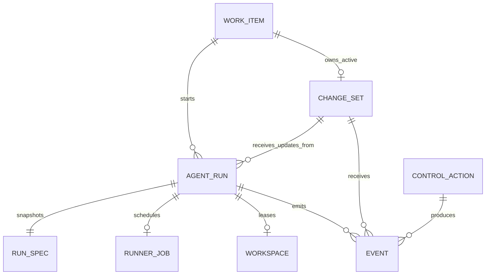
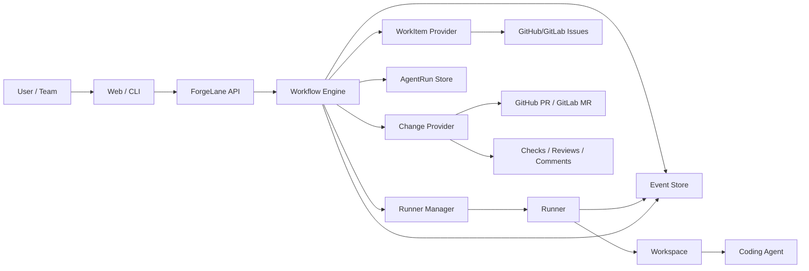
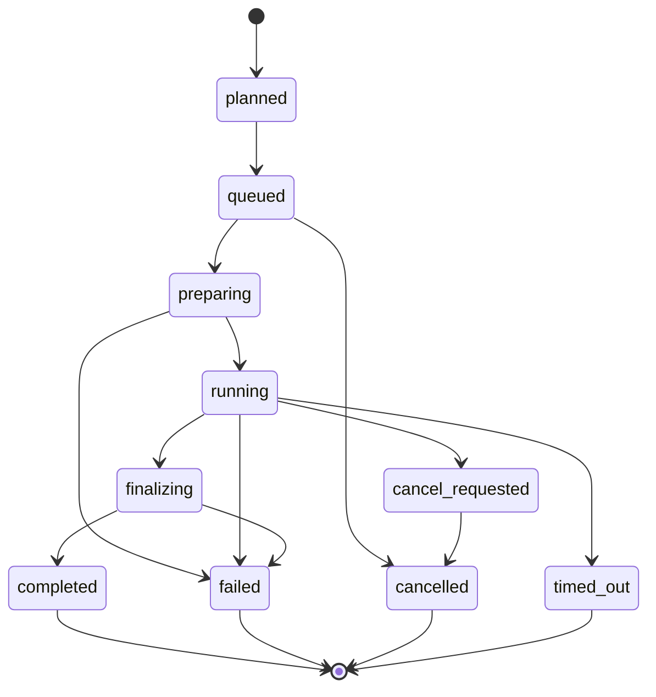

# v0 Architecture

This document captures the first architecture boundary for ForgeLane. It is a
working model for the v0 delivery loop, not a final system design.

## Architecture Goal

v0 should prove one controlled delivery loop:

```text
WorkItem -> AgentRun -> RunSpec -> RunnerJob -> Workspace -> Agent -> ChangeSet
```

The runner must not consume issues directly. The workflow layer turns a
WorkItem into an AgentRun and a RunSpec, then asks a runner to execute that
spec in an isolated workspace.

## Overall Architecture

v0 is a CLI-first modular monolith with explicit internal boundaries. The
control plane owns workflow decisions, current state, audit events, run
coordination, and workspace leases. Providers remain the source of truth for
external work and change records. Runners and agent adapters execute a concrete
RunSpec inside a leased Workspace and report evidence back to the control
plane.

The high-level shape is:

```text
Client / CLI
  -> Workflow Engine
  -> Store + Event Log
  -> Provider Boundaries
  -> Runner Boundary
  -> Workspace
  -> AgentAdapter
  -> Change Provider
```

The important dependency direction is inward toward ForgeLane-owned workflow
state. Providers, runners, workspaces, and agent adapters are replaceable
edges; they must not bypass workflow decisions, permission checks, or
transactional event recording.

## Core Chain

- WorkItem: the task entry point, usually a GitHub/GitLab issue in v0.
- AgentRun: ForgeLane's record of one bounded agent attempt.
- RunSpec: the immutable execution package derived from the WorkItem, target
  repository, branch, agent choice, and constraints.
- RunnerJob: the executable job given to a runner.
- Workspace: the isolated checkout and process environment used by the runner.
- Agent: the coding agent process invoked inside the workspace.
- ChangeSet: the branch, PR/MR, and commits produced or updated by the run.

## Data Model Summary

The v0 domain model should stay small enough to reason about in one delivery
loop. Provider-owned records are referenced, snapshotted, and synchronized;
ForgeLane-owned records drive execution, control, and audit.



Conceptually:

- WorkItem is the task intent and provider reference.
- ChangeSet is the reviewable delivery artifact for that WorkItem.
- AgentRun is one attempt to move the WorkItem or ChangeSet forward.
- RunSpec is the immutable input to an AgentRun.
- RunnerJob is the execution request assigned to a runner.
- Workspace is the leased execution environment for the run.
- ControlAction is an operator or policy request.
- Event is the immutable audit record tying the loop together.

This summary is not a database schema. It is the boundary map that later schema,
API, and UI decisions should preserve.

## Component Boundary Diagram



## Subcomponent Responsibilities

Client / CLI / API edge:

- parses user intent and provider refs;
- opens the ForgeLane instance store;
- calls workflow operations;
- prints or returns current-state read models;
- must not encode provider, runner, or permission policy decisions directly.

Workflow engine:

- converts WorkItems and ControlActions into AgentRuns, RunSpecs, RunnerJobs,
  Workspace leases, ChangeSet transitions, and Events;
- owns state-transition rules and idempotency decisions;
- calls provider, runner, and store boundaries instead of letting those edges
  mutate authoritative state directly.

Store and Event log:

- persist ForgeLane-owned current-state rows;
- append compact audit Events in the same transaction as authoritative state
  changes;
- keep large logs, artifacts, and provider payloads out of Event payloads;
- support read models for CLI, API, and future UI surfaces.

Repository config:

- records ForgeProject defaults for local shorthand resolution;
- resolves numeric issue shorthand to canonical ProviderRefs only when the
  current directory clearly maps to an initialized ForgeProject;
- stores ForgeLane-owned config in the instance state store, not target repos.

WorkItem provider:

- reads provider-owned task sources such as GitHub Issues;
- returns snapshots and stable ProviderRefs;
- does not create AgentRuns, mutate ChangeSets, or write ForgeLane state.

Change provider:

- manages provider-owned branch and PR/MR side effects;
- creates or updates draft PRs/MRs only after workflow decides there is a
  reviewable branch or commit;
- reads provider feedback signals such as checks, reviews, and comments.

Runner manager and runner:

- receive explicit RunnerJob and RunSpec input;
- prepare or reuse a Workspace;
- invoke the selected AgentAdapter;
- report logs, artifacts, commit refs, structured Events, and terminal status
  through workflow-owned callbacks or event sinks;
- do not read issue trackers or decide delivery policy.

Workspace:

- leases a filesystem execution environment to one active AgentRun;
- keeps `repo/` separate from logs, artifacts, tmp files, credentials, and
  runner metadata;
- is retained or cleaned according to run outcome and debug policy.

AgentAdapter:

- invokes one coding agent or command preset inside the scoped Workspace;
- receives only explicit per-run inputs and credentials;
- produces file changes, logs, artifacts, and optional commit metadata;
- does not push provider branches or create PRs/MRs directly.

## Provider Boundary

v0 should keep task intake and change delivery separate.

- WorkItem Provider: reads and comments on task sources such as GitHub Issues or
  GitLab Issues.
- Change Provider: prepares branches, creates draft PRs/MRs, reads change
  state, and surfaces checks, reviews, comments, and approvals.

GitHub and GitLab may implement both provider capabilities, but ForgeLane should
not collapse the two concepts. Future combinations should remain possible:

```text
Jira WorkItem -> GitHub ChangeSet
Slack WorkItem -> GitLab ChangeSet
Local markdown WorkItem -> GitHub ChangeSet
```

The in-product GitHub provider should call the GitHub API directly. The `gh` CLI
may remain a developer and agent-workflow convenience, but ForgeLane provider
implementations should not depend on shelling out to `gh`.

## Provider Sync Model

GitHub and GitLab remain the source of truth for provider-owned objects:
issues, PRs/MRs, commits, reviews, comments, checks, and CI status. ForgeLane
stores stable references, snapshots, cached views, and ForgeLane-owned state.

The first local CLI-first cut should rely on explicit provider API reads during
import, finalization, retry, and manual refresh. The architecture should remain
compatible with three later sync paths:

- webhook ingestion for provider events when available;
- polling as a backstop when webhooks are missing, delayed, or unavailable;
- manual refresh for operator-driven recovery and debugging.

Sync should be idempotent. Provider event IDs, provider refs, commit SHAs, or
other stable keys should be used to avoid duplicate events and duplicate state
changes. For WorkItems, the canonical ProviderRef is the uniqueness key:
re-importing `github://github.com/owner/repo/issues/123` refreshes the existing
WorkItem snapshot and records a new audit Event rather than creating a duplicate
WorkItem.

### Source-of-Truth Boundary

```text
Provider-owned:
  WorkItem title/body/status/comments
  branch existence and commit history
  PR/MR title/body/status/reviews/comments
  CI/check status
  merge/close state

ForgeLane-owned:
  AgentRun status
  RunSpec snapshots
  RunnerJob status
  workspace leases
  ControlActions
  approvals required by ForgeLane policy
  events, logs, artifacts, and cached provider snapshots
```

When provider-owned state conflicts with cached ForgeLane state, the provider
wins. ForgeLane should record the reconciliation as an event instead of silently
rewriting history.

## ChangeSet Model

A ChangeSet is ForgeLane's internal model for one reviewable delivery artifact.
It is not just a provider PR/MR, but the ForgeLane-owned record that connects a
WorkItem, branch, PR/MR, commits, and external feedback signals.

v0 should use this default relationship:

```text
WorkItem
  has many AgentRuns
  has zero or one active ChangeSet

ChangeSet
  belongs to one WorkItem
  has one branch
  has zero or one draft PR/MR at first
  has many commits
  has many signals
  can be updated by multiple AgentRuns
```

The first AgentRun for a WorkItem should create or claim the active ChangeSet.
Later retry or request-changes runs should usually reuse that same ChangeSet and
append commits to the existing branch and draft PR/MR.

Create a new ChangeSet only when the prior one is abandoned, closed without
merge, or intentionally replaced by a human decision.

### ChangeSet Contents

v0 ChangeSet fields should stay provider-neutral:

```text
id
work_item_ref
provider
repo_ref
base_branch
branch_ref
change_ref        # GitHub PR / GitLab MR, nullable before creation
status
created_by_run_id
active_run_id
commit_refs
signal_refs
```

### ChangeSet Status

The initial status model can be small:

```text
planned
branch_ready
draft_open
under_review
changes_requested
approved
merged
closed
abandoned
```

Provider state remains provider-owned. ForgeLane stores the status it needs to
coordinate runs and display progress, plus provider refs and snapshots needed
for audit.

### Signals

Signals are provider feedback attached to a ChangeSet. The first v0 delivery
loop does not need a full signal processor. When synced, signals should be read
through the Change Provider and displayed as part of the run detail.

Examples:

- CI/check status
- review comment
- approval
- requested changes
- PR/MR comment
- merge or close event

Signals should not be modeled as AgentRun state. The same ChangeSet can receive
signals before, during, and after multiple AgentRuns.

## AgentRun Model

An AgentRun is ForgeLane's record of one bounded agent attempt. It is the unit
of execution, control, logs, and audit for a runner invocation.

An AgentRun is not the WorkItem and is not the ChangeSet. A WorkItem can have
many AgentRuns, and those runs may update the same ChangeSet over time.

```text
WorkItem
  has many AgentRuns

AgentRun
  belongs to one WorkItem
  targets zero or one ChangeSet at creation time
  owns one immutable RunSpec snapshot
  has zero or one RunnerJob
  has one workspace lease while active
  has many events and log segments
  has one terminal outcome
```

The RunSpec snapshot is immutable after the AgentRun starts. If the task,
branch, agent choice, or constraints need to change, ForgeLane should create a
new AgentRun instead of rewriting the old one.

### AgentRun Status

v0 should keep the status model focused on execution:

```text
planned
queued
preparing
running
cancel_requested
finalizing
completed
failed
cancelled
timed_out
```

Only these statuses describe the attempt itself. Review state, CI state,
approval state, merge state, and requested-changes state belong to the
ChangeSet.

### Lifecycle



The first `runs execute` slice may move directly from `preparing` to `running`
to `completed` or `failed`, while leaving `queued`, `finalizing`,
`cancel_requested`, `cancelled`, and `timed_out` available for later scheduler,
finalization, stop, and timeout slices.

`completed` means the runner finished its assigned attempt and reported its
outputs. It does not mean the PR/MR was approved, merged, or even correct.

v0 should allow only one active AgentRun per ChangeSet. This keeps branch
ownership simple and avoids two agents pushing competing commits to the same
review artifact.

## Event and Audit Model

Events are the audit spine of ForgeLane. They are immutable records of things
that happened in the delivery loop.

An event should answer:

- what happened;
- when it happened;
- who or what caused it;
- which WorkItem, AgentRun, ChangeSet, provider ref, or workspace it affected;
- what provider or runner evidence supports it.

### Event Shape

v0 events can start with a small provider-neutral shape:

```text
id
type
occurred_at
actor
forge_project_id
subject_type
subject_ref
work_item_id
work_item_ref
agent_run_id
change_set_id
provider_ref
correlation_id
payload
```

Large logs and artifacts should not be stored directly inside events. Events
should point to log segments, artifacts, provider refs, or snapshots.
Foreign-key columns such as `forge_project_id` and `work_item_id` are queryable
associations; `payload` is for compact supporting evidence, not the primary
relationship model.

### Event Types

Initial event groups:

- work item: imported, snapshot recorded, refreshed
- agent run: created, queued, started, status changed, completed, failed,
  cancelled, timed out
- runner: job created, workspace prepared, agent process started, agent process
  exited
- change set: branch created, draft opened, commit detected, PR/MR updated,
  closed, merged
- provider signal: CI/check updated, review comment created, approval recorded,
  requested changes recorded
- control action: requested, accepted, rejected, executing, succeeded, failed

The event log should be append-only from the product point of view. If state is
corrected later, record a correction event instead of rewriting old events.

v0 should use a transactional audit log rather than pure event sourcing. For an
authoritative state change, the workflow/store layer should append the Event and
update the current-state row in the same SQLite transaction. Current API, CLI,
and UI reads should query current-state tables directly; Events provide the
audit trail and debugging timeline, not the only source for rebuilding state.

Large logs and noisy process output should be written to workspace log files and
indexed by `log_segments`, or stored as artifacts. Do not create one Event per
stdout line.

## ControlAction Model

A ControlAction is a human or policy request to change the delivery loop. It is
not the same thing as an event. The action records intent and execution state;
events record what actually happened.

```text
id
type
target_type
target_ref
requested_by
reason
input
status
created_at
decided_at
result_event_refs
```

Candidate statuses:

```text
requested
accepted
rejected
executing
succeeded
failed
cancelled
```

### Action Targets

```text
start             -> WorkItem      -> creates AgentRun
stop              -> AgentRun      -> requests cancellation
retry             -> AgentRun      -> creates new AgentRun
request_feedback  -> AgentRun      -> records pending Run attention feedback
send_feedback     -> AgentRun      -> answers pending Run attention feedback
request_approval  -> AgentRun      -> records pending Run attention approval
approve/reject    -> AgentRun      -> resolves pending Run attention approval
request_changes   -> ChangeSet     -> records provider signal and may create run
close             -> ChangeSet     -> closes provider PR/MR when allowed
approve           -> ChangeSet     -> records approval or forwards provider approval
reassign          -> WorkItem      -> changes ForgeLane owner/agent assignment
```

The Run attention loop uses `AgentRun`-targeted ControlActions for user feedback
or approval needed by an active or planned run. Pending attention is stored as a
`requested` ControlAction and surfaced from run detail; user responses create a
new succeeded ControlAction and resolve the pending request. This is separate
from ChangeSet/provider mutation approval: provider branch push and draft PR
creation still go through ChangeProvider boundaries and their own auditable
ControlActions instead of sending credentials or decisions through the
AgentAdapter process.

The first v0 slices should start with `start`, `stop`, `retry`, and the narrow
Run attention actions. `close` can be added after ChangeSet and draft PR
creation exist. ChangeSet-level `request_changes`, `approve`, `merge`, and
richer reassignment should stay behind explicit product decisions because they
depend on review and team policy semantics beyond the first issue-to-draft-PR
loop.

## Permission and Approval Boundary

Permission checks should live in the API/workflow layer, not inside the runner
or the coding agent.

The runner can execute only the RunSpec it receives. The agent can operate only
within the credentials, workspace, and command permissions granted for that run.

Candidate v0 permission tiers:

```text
read provider data
create branch
push commits to ForgeLane-managed branch
create or update draft PR/MR
stop active AgentRun
retry AgentRun
close draft PR/MR
access secrets
merge PR/MR
```

The early product should be conservative:

- agent-created branches and draft PRs can be automated;
- stop and retry can be direct human controls;
- secret access should be explicit and scoped;
- merge should stay human-controlled unless a later policy decision changes it;
- privileged actions should always produce ControlAction and Event records.

## Config Model

Configuration should make the delivery loop explicit without turning v0 into a
general workflow engine.

Candidate config scopes:

```text
instance config
provider config
repository config
runner config
agent config
policy config
notification config
```

v0 can start with repository-level defaults. The common GitHub/GitLab case
should be represented as a ForgeProject because one provider-hosted project can
imply both the TargetRepository and the DefaultWorkItemSource:

```text
forge_project.provider
forge_project.base_url
forge_project.path
default_base_branch
branch_name_template
default_agent
runner_selector
draft_pr_enabled
workspace_retention_policy
run_timeout
allowed_control_actions
```

Plain Git repositories that do not have a WorkItem provider may be represented
as a TargetRepository without a DefaultWorkItemSource. Split TargetRepository
and DefaultWorkItemSource configuration should be reserved for cases where the
code repository and WorkItem source genuinely differ, such as Jira WorkItems
delivered through a GitHub ChangeSet.

Repository config may let the CLI accept shorthand WorkItem input such as issue
number `123` for the configured default provider/repo. Workflow, persistence,
Events, and audit records should store the resolved canonical ProviderRef, such
as `github://github.com/owner/repo/issues/123`, not the shorthand input.
Repository initialization should prefer a canonical repository URL such as
`https://github.com/owner/repo`. Public forge shorthand such as
`--provider github --repo owner/repo` may remain as a CLI convenience and should
normalize to the same internal config shape rather than becoming a separate
persisted identity.
The first repository-config implementation should write only the ForgeProject
shape for GitHub. Plain Git target repositories and split TargetRepository /
DefaultWorkItemSource configuration are modeled here but can wait for later
slices that need them.
When repository initialization infers a ForgeProject from the current checkout,
the first implementation should inspect only the `origin` remote. If `origin`
is missing or cannot be parsed for the requested provider, initialization should
fail clearly and ask for `--repo-url` rather than guessing from other remotes.
For GitHub inference, the first parser should accept common Git remote forms:
`https://github.com/owner/repo`, `https://github.com/owner/repo.git`,
`git@github.com:owner/repo.git`, and `ssh://git@github.com/owner/repo.git`.
It should normalize them to `provider=github`, `baseUrl=https://github.com`,
and `path=owner/repo`, and reject branch/tree webpage URLs or ambiguous
shorthand that is not a Git remote URL.
Repository initialization should be idempotent when the ForgeProject already
exists in the ForgeLane instance. v0 should store ForgeProjects and other
control-plane state in an instance-global SQLite database at
`~/.forgelane/forgelane.db`, not in the target source repository. The current
working directory can still be used to infer a default ForgeProject from the
`origin` remote, but the persisted source of truth is the ForgeLane instance
database. This lets one local ForgeLane instance manage multiple
ForgeProjects and keeps target repositories free of control-plane state.

A target repository may also opt in to a repo-owned workflow contract at
`forgelane.workflow.json`. This file is version-controlled repository guidance,
not ForgeLane instance state, and it should be resolved from the target Git
repository root. It can declare durable agent-run expectations such as the
default AgentAdapter preset, semantic tracker label mappings, expected test
command, evidence requirements, and approval policy hints. It must not store
secrets, local paths, current run ids, last errors, provider snapshots, or other
instance/run state. Plain `forgelane init` should detect a missing workflow
contract and suggest the explicit creation command without modifying the
repository; `forgelane workflow init` and `forgelane init --with-workflow` are
the opt-in repository writes. Manual `runs create` and `runs start` should
continue without label eligibility checks when the contract is missing, while
the generated contract can document that future automated watcher behavior
should use the contract's trigger/readiness role mappings.

Provider tokens, webhook secrets, and runner credentials should be treated as
secret material, not normal config values. The architecture should allow local
self-hosted secrets first and external secret stores later.

For v0 GitHub access, use a locally configured token or PAT secret. Do not build
OAuth, GitHub App installation flows, or provider-backed identity binding until
the product moves beyond the trusted single-user/self-hosted baseline.

Agent credentials are separate from provider mutation credentials. A command
AgentAdapter must not inherit the operator's shell home directory, Codex home
directory, Git credential helpers, or provider tokens. If an agent needs model
access, the RunSpec should declare an explicit `credential_grants` entry and the
runner should materialize only that credential into the agent environment. The
first supported grant is an OpenAI API key exposed to the child process as
`OPENAI_API_KEY` from ForgeLane-managed secret material. The first local
self-hosted implementation may resolve that secret from the ForgeLane process
environment behind a SecretStore boundary; later implementations can replace
that source with SQLite-encrypted local storage, Keychain, Vault, or another
external secret store without changing the RunSpec grant shape. OAuth/access-
token grants can be added later as another grant kind, but they should still be
materialized into a run-scoped home or token file rather than by inheriting the
operator's local Codex login directory.
Granted secret values must be registered with the log-capture layer for exact
redaction before stdout/stderr are written to workspace log files or segment
previews. Redaction is a last line of defence; least-privilege grants and
minimal injection remain the primary control.

Policy config should stay narrow in v0. It can define what actions are allowed,
but it should not become a full dynamic workflow language before the first
vertical slice works.

## Runner Boundary

The runner is an execution boundary, not a product-decision boundary.

The runner should:

- receive a RunSpec or RunnerJob;
- prepare or reuse an isolated workspace;
- clone, fetch, and check out the target branch;
- invoke the selected coding agent;
- stream logs and structured events back to ForgeLane;
- report commits and terminal status.

The runner should not:

- decide which WorkItem to execute;
- read issue trackers directly;
- decide whether a PR/MR should be merged;
- own approval policy;
- mutate ForgeLane run state without going through events.

The v0 runner implementation can be a Go process runner, but it should sit
behind a narrow runner boundary. A future Rust runner daemon should be able to
replace the implementation without changing the WorkItem, AgentRun, RunSpec,
RunnerJob, Workspace, ChangeSet, or Event model.

The boundary should pass explicit inputs and outputs:

```text
input:  RunnerJob + RunSpec + Workspace lease + AgentAdapter config
output: log segments, structured runner events, commit refs, terminal status
```

The runner must report through an event sink or workflow-owned callback. It
must not directly write authoritative run state.

The agent, runner, and change provider should have separate responsibilities:

```text
AgentAdapter:
  produces file changes, logs, artifacts, and optional commit metadata

Runner:
  prepares the workspace and sandbox
  materializes local commits from workspace changes
  reports commit refs and terminal status

Workflow / Change Provider:
  pushes ForgeLane-managed branches
  creates or updates draft PRs/MRs
  records ChangeSet state and Events
```

Provider mutation credentials should stay outside the agent sandbox by default.
The AgentAdapter environment should be scrubbed and should receive only
explicit per-run credentials required for local execution. Branch push and
draft PR/MR creation belong to the workflow/change-provider layer, not to the
agent process.
For the Codex command preset, v0 should prefer the official API-key path by
injecting `OPENAI_API_KEY` through a declared credential grant. The runner
should set a run-scoped `HOME` under the Workspace and should not pass through
the operator's `CODEX_HOME`.

## Workspace and Sandbox Model

A Workspace is a leased execution environment for one active AgentRun. It is
where the repository checkout, branch state, agent process, logs, and artifacts
come together.

The workspace should keep the repository checkout separate from ForgeLane-owned
execution metadata:

```text
workspace/
  repo/        repository checkout mounted or copied for agent execution
  logs/        captured stdout/stderr log files plus segment indexes
  artifacts/   summaries, patches, screenshots, debug files
  tmp/         runner scratch space
```

Only `repo/` is eligible input to a ChangeSet. ForgeLane-owned logs,
artifacts, temporary files, credentials, and runner metadata must not be staged
into the delivery commit unless the task explicitly writes a normal project
file under `repo/`.

```text
Workspace
  belongs to one active AgentRun while leased
  is prepared from a RunSpec
  contains a repository checkout
  exposes scoped execution inputs to the runner or sandbox
  streams logs and artifacts
  is released, retained, or cleaned after terminal status
```

Candidate workspace states:

```text
allocated
preparing
ready
in_use
finalizing
released
failed
```

v0 can use a single-node local workspace model:

- one workspace directory per AgentRun;
- clean checkout or controlled reuse by repo and branch;
- per-run timeout;
- scoped provider credentials held by the workflow, runner, or provider layer;
- captured stdout/stderr and structured agent logs;
- artifact directory outside the repository checkout for patches, summaries,
  screenshots, or debug files;
- cleanup policy that can retain failed workspaces for debugging.

The sandbox boundary should stay abstract in the control plane. The first
runner can be simple, but the architecture should not prevent a later Rust
runner, container sandbox, VM sandbox, or remote runner pool.

For Docker, sbox, or another sandbox, the simplest v0 extraction model is a
runner-owned repository checkout bind-mounted into the sandbox. The agent edits
that file tree, then the runner exits the sandbox boundary and computes the
candidate ChangeSet from `git status`, `git diff`, and untracked files inside
`repo/`. If there are no tracked or untracked repository changes, the runner
must not create an empty commit or draft PR/MR. A more isolated future runner
can use patch, tar, overlay, or snapshot export instead, but the control-plane
contract should stay the same: the agent produces a changed file tree; the
runner materializes local commits; the change provider performs remote provider
mutations.

## Deployment Shape

ForgeLane should support a small self-hosted deployment before assuming a cloud
runner fleet.

Candidate deployment shapes:

```text
single-node local:
  API, UI, store, scheduler, and runner on one machine

self-hosted server:
  API, UI, store, and scheduler on a server
  one or more registered runners

future cloud/control-plane:
  hosted API and UI
  customer-managed or cloud-managed runners
```

The v0 architecture should be compatible with the single-node shape:

- one process or a small process set;
- local filesystem workspace root;
- SQLite or another small persistent store candidate;
- explicit provider API reads and manual refresh first; webhook and polling
  compatibility later;
- runner registration can be static config before dynamic fleet management.

This keeps early development concrete while preserving a path to remote runners
and hosted control surfaces later.

## RunSpec Shape

A v0 RunSpec should be explicit enough for the runner to execute without asking
the provider layer for task intent:

```json
{
  "run_id": "run_123",
  "work_item": {
    "provider": "github",
    "ref": "liiujinfu/forgelane#42",
    "title": "Add GitLab provider",
    "body_snapshot": "..."
  },
  "repo": {
    "provider": "github",
    "owner": "liiujinfu",
    "name": "forgelane",
    "base_branch": "main"
  },
  "branch": "forgelane/issue-42",
  "agent_adapter": {
    "kind": "command",
    "preset": "codex",
    "env_policy": "scrubbed"
  }
}
```

The WorkItem snapshot is important. A run should be auditable even if the source
issue changes after execution starts.

If a repo workflow contract supplies the default AgentAdapter preset, RunSpec
creation should copy the selected preset into this immutable snapshot. Later
contract edits affect future runs only; they do not mutate existing RunSpecs.

## UI Surface

The first UI should make the delivery loop observable and controllable. It does
not need to replace GitHub or GitLab views.

The core v0 surface is a run detail view:

- WorkItem title, provider ref, and source link;
- ChangeSet branch, draft PR/MR link, and current change status;
- active AgentRun status and state transitions;
- event timeline;
- log stream or log segments;
- commit list;
- optional provider signals such as CI/check and review state when synced;
- control actions such as stop and retry, with request-changes and close added
  only after the matching provider semantics exist.

A small list view should let users find active, failed, completed, and waiting
runs. Mobile/PWA can start as a responsive read-and-control surface rather than
a separate native app.

The UI should link out to provider-owned detail pages instead of duplicating
full provider functionality.

## External API Boundary

The API should expose ForgeLane-owned resources and provider-backed references.
It should not mirror the entire GitHub or GitLab API.

Candidate v0 resources:

```text
work-items
change-sets
agent-runs
runner-jobs
workspaces
control-actions
events
logs
artifacts
provider-sync
repository-configs
```

The first API surface can be resource-oriented:

- create or import a WorkItem reference;
- start an AgentRun for a WorkItem;
- read AgentRun status, events, and logs;
- request a ControlAction;
- read the active ChangeSet for a WorkItem;
- refresh provider state;
- read or update repository config.

Provider-specific details should stay behind provider refs and snapshots. API
clients should not need to know whether a ChangeSet is backed by GitHub or
GitLab unless they need to open the provider link or show provider-specific
metadata.

## Primary Flow

1. A user selects or references a WorkItem.
2. The workflow layer fetches the WorkItem and records a snapshot.
3. ForgeLane creates an AgentRun.
4. The workflow layer derives a RunSpec from the WorkItem, target repository,
   branch naming rule, and selected agent.
5. Runner Manager creates a RunnerJob.
6. Runner prepares a workspace and invokes the agent.
7. Runner streams logs, events, commits, and terminal status back to ForgeLane.
8. After the first commit is pushed successfully, the workflow layer uses the
   Change Provider to create or update a draft PR/MR for the branch.
9. ForgeLane shows run state, events, logs, branch, and PR/MR link.
10. A human can stop, retry, request changes, close, or approve according to
    the current run and change state.

## WorkItem Import Slice

The first v0 tracer bullet establishes the pre-run WorkItem import path before
invoking agents or mutating provider change state:

```text
forgelane work-items import github://github.com/owner/repo/issues/123
forgelane work-items import 123
  -> import and snapshot WorkItem
  -> persist ProviderRef and compact provider-owned issue snapshot
  -> append WorkItem import/snapshot Event
  -> show imported WorkItem snapshot from SQLite
```

This slice does not run the agent, push commits, or create a draft PR. Its
purpose is to prove that provider-owned WorkItem data can be referenced,
snapshotted, stored separately from execution state, audited with an Event, and
observed from the CLI.

Milestone 1 acceptance should stay narrow:

```text
forgelane work-items import github://github.com/owner/repo/issues/123
forgelane work-items import 123
forgelane work-items show github://github.com/owner/repo/issues/123
forgelane work-items show --issue 123
forgelane work-items show --id <local_work_item_id>
```

Full ProviderRef input should always be accepted. Shorthand input requires
repository config that can resolve the issue number to a canonical ProviderRef.
The command may read a real GitHub issue snapshot, but it should not mutate
GitHub provider state. Passing acceptance means SQLite contains the imported
WorkItem, compact provider snapshot, resolved canonical ProviderRef, and Events,
and the CLI can show the WorkItem snapshot plus event timeline. Repeating the
same import should update the existing WorkItem snapshot and append another
Event rather than inserting a second WorkItem row.

`work-items import` should be a real persistent import, not a preview or dry-run
mode. On success it should print a stable human-readable summary, including the
canonical ProviderRef, repository, issue number, title, normalized status,
provider update time, local refresh time, Event type, and Event id. JSON output
can wait until the API/CLI contract needs machine-readable automation.

`work-items show` should make provider identity the primary user-facing lookup
path. Full ProviderRefs work without repository config. `--issue 123` is
available only when repository config can resolve it. Explicit local id flags
such as `--id` are allowed as debugging and fallback paths, but users should
not need to remember internal WorkItem ids.
`work-items show` should read only the cached snapshot in the ForgeLane
instance database. It must not contact the provider, refresh the snapshot, write
the database, or append Events. Snapshot freshness should be visible through
`provider_updated_at` and `refreshed_at`; users refresh provider state by
running `work-items import` explicitly.
In the instance-global DB model, numeric issue shorthand should resolve through
the current working directory's `origin` remote. The remote is normalized to a
ForgeProject ref such as `github://github.com/owner/repo`, then matched against
the `forge_projects` table before constructing
`github://github.com/owner/repo/issues/123`. If the current directory has no
supported `origin` remote or the inferred ForgeProject has not been initialized,
the command should fail clearly and ask the user to run `forgelane init` or use
a full ProviderRef. Do not add a global default project or infer from "only one
project in the database" in this slice.
Full ProviderRef import is self-contained and should not require pre-existing
ForgeProject config. When importing
`github://github.com/owner/repo/issues/123`, the workflow may upsert the
corresponding ForgeProject row before writing the WorkItem and Event so later
queries and runs can join against the project. Numeric shorthand remains
stricter because `123` is ambiguous without current-directory project context.
That supporting ForgeProject upsert should not append its own Event in this
slice; the user-visible audited action remains the WorkItem import or refresh.

The WorkItem snapshot should store the current cached provider issue state in
the `work_items` table rather than a separate `provider_snapshots` table:

```text
id
forge_project_id      # references forge_projects(id)
provider_ref          # unique canonical ProviderRef
provider              # github
repository_ref        # github://github.com/owner/repo
provider_issue_number # GitHub issue number within the repository
title
body
status                # normalized: open, closed, unknown
provider_status_raw
url
provider_updated_at
imported_at
refreshed_at
```

Do not require a separate provider external id or GitHub node id in this slice.
Those identifiers can be introduced later when webhook, GraphQL, or provider
sync work needs them. For #3, the canonical `provider_ref` and
`repository_ref` plus `provider_issue_number` are the relevant identities.

The full issue body belongs in the WorkItem snapshot so later RunSpec creation
can preserve the issue intent. Event payloads should remain compact and should
not copy the issue body. Labels, assignees, milestones, comments, review
feedback, checks, and CI status are deferred to later provider sync and review
loop slices.
If the provider read discovers that the requested issue number is actually a
pull request or merge request, #3 should reject it with a clear user-visible
error rather than storing it as a WorkItem. In v0, issues/tickets/tasks are
WorkItem inputs; PRs/MRs are ChangeSet delivery artifacts or later review/fix
inputs and should be modeled in a separate slice.

Initial WorkItem import Events should stay provider-neutral:

```text
work_item.imported
work_item.refreshed
```

The first import appends `work_item.imported`; repeated imports for an existing
ProviderRef append `work_item.refreshed`, even when the provider content and
`provider_updated_at` value have not changed. A repeated explicit import is
still a local refresh action: it updates `refreshed_at`, preserves
`imported_at` as the first local import time, and writes an audit Event.
Event payloads can include compact fields such as ProviderRef, repository ref,
provider update time, and local WorkItem id. Failed parsing, provider reads,
and rolled-back transactions should not write Events in this slice; successful
WorkItem upsert and Event append must happen in the same SQLite transaction.
For WorkItem import Events, the `events` table should persist nullable,
indexed `forge_project_id` and `work_item_id` columns instead of requiring later
queries to extract these associations from JSON payload. `work_item_id` links
directly to the imported/refreshed WorkItem, and `forge_project_id` supports
project-scoped audit queries. The Event payload remains compact supporting
evidence and must not copy the full provider issue body.
If a full ProviderRef import also upserts the corresponding ForgeProject row,
that supporting project write should be part of the same transaction but should
not create a separate Event.

GitHub issue reads should go through a fake-friendly WorkItemProvider boundary.
Workflow and CLI tests should use fake providers by default. The real GitHub
provider should implement the minimal read-only issue path, use `GITHUB_TOKEN`
as the local token/PAT source when needed, never persist or print the token, and
distinguish user-visible not-found, auth/permission, and generic provider
failures. If the GitHub issue response represents a pull request, return a
specific "not an issue WorkItem" error. Comments and GitHub mutations are out
of scope.

The canonical ProviderRef parser for this slice should accept the URL-like
ForgeLane ProviderRef and repository-config shorthand only. Do not accept raw
GitHub web URLs such as `https://github.com/owner/repo/issues/123` in this
slice. GitHub Enterprise and configurable provider hosts are deferred behind the
repository/provider configuration work rather than being implemented in the
WorkItem import slice.

Milestone 1 tests should use two layers:

- default automated tests use a fake GitHub provider and temporary SQLite
  database so the import workflow, store, event writes, and CLI output are
  repeatable without network access or credentials;
- an optional read-only GitHub smoke test may use a local token secret to fetch a
  real issue snapshot, but it should not run in default CI and must not mutate
  provider state.

The initial Go codebase should be a modular monolith, not separate services:

```text
cmd/forgelane                 CLI entry point
internal/domain               WorkItem, AgentRun, RunSpec, ChangeSet, Event
internal/workitems            provider-owned WorkItem intake and normalization
internal/workflow             orchestration and state transitions
internal/store/sqlite         SQLite persistence
internal/provider/github      GitHub WorkItem and Change Provider
internal/runner               runner interface and contracts
internal/runner/process       v0 local process runner implementation
internal/agentadapter/command generic command adapter and Codex CLI preset
internal/events               event append/query helpers
```

This structure keeps v0 deployable as one binary while preserving replacement
points for a later Rust runner daemon, additional providers, and richer client
surfaces.

`internal/workitems` is a narrow intake boundary for issue #3: it owns
ProviderRef parsing, provider snapshot DTOs, and provider-status normalization
before data reaches SQLite. Durable execution-domain behavior still belongs in
`internal/domain` and `internal/workflow` as the AgentRun slices are introduced.

The first SQLite schema should stay limited to the state this tracer bullet
actually exercises:

```text
~/.forgelane/forgelane.db

forge_projects
work_items
events
```

Issue #3 may introduce the minimal SQLite driver dependency needed to exercise
real persistence. Prefer `modernc.org/sqlite` behind `database/sql` so the v0
CLI and CI remain CGO-free. Do not add an ORM or migration framework in this
slice; a small explicit schema initializer is enough.
Write commands such as `init` and `work-items import` should open
`~/.forgelane/forgelane.db` and run an idempotent schema initializer before
accessing persistence. Read-only commands such as `work-items show` should open
the existing database in read-only mode and must not initialize schema, create
the state directory, or append Events. Help and version commands should not
touch the database. Full ProviderRef import may create the `~/.forgelane`
directory and database on first use; numeric shorthand still requires an
existing ForgeProject so it can resolve to a canonical ProviderRef.

## AgentRun and Runner Execution Slice

The second v0 tracer bullet proves the runner boundary without mutating
provider change state:

```text
forgelane runs create <provider-ref-or-issue>
  -> import WorkItem if missing
  -> create succeeded start ControlAction
  -> create planned AgentRun
  -> persist immutable RunSpec snapshot
  -> append control_action.succeeded, agent_run.created, run_spec.created

forgelane runs prepare <run_id>
  -> create RunnerJob
  -> lease Workspace
  -> prepare local checkout under workspace/repo/
  -> append workspace.allocated
  -> append workspace.prepared or workspace.prepare_failed

forgelane runs execute <run_id>
  -> invoke generic command AgentAdapter inside the Workspace
  -> capture stdout/stderr in workspace log files indexed by log segments
  -> report runner Events and terminal AgentRun status

forgelane runs show <run_id>
forgelane events list --run <run_id>
  -> inspect local current-state rows and run Events
```

This slice must avoid pushing commits or creating draft PRs until the ChangeSet
slice.

Milestone 2 acceptance should cover:

- a planned AgentRun and immutable RunSpec can be created for a WorkItem;
- a RunnerJob and Workspace can be created for that AgentRun;
- the Workspace clones the current repository into `repo/` while keeping logs,
  artifacts, and tmp outside the checkout;
- Workspace preparation failures are retained and audited;
- run-scoped Events can be listed from local state;
- a harmless command preset can run in an isolated local Workspace;
- Codex command execution uses an explicit OpenAI credential grant rather than
  inheriting the operator's local Codex login directory;
- stdout/stderr are captured as log segments, not one Event per line;
- runner lifecycle Events are appended transactionally with state changes;
- timeout and cancel paths produce terminal AgentRun outcomes in the following
  terminal-outcome/control slice;
- the runner does not read GitHub issues or mutate provider state.

Schema added by this slice:

```text
control_actions
agent_runs
run_specs
runner_jobs
workspaces
log_segments
```

## Third Implementation Slice

The third v0 tracer bullet should introduce the reviewable delivery artifact:

```text
forgelane runs finalize <run_id>
  -> detect workspace changes
  -> materialize local commit refs
  -> create or claim active ChangeSet
  -> push ForgeLane-managed branch
  -> create or update draft PR after first successful pushed commit
  -> record ChangeSet status, provider refs, and Events
```

In this tracer bullet, `forgelane runs finalize <run_id>` is a CLI/debug entry
to the same workflow phase that should run automatically after a successful
execution. It is not a required human approval step. This is the first slice
that mutates GitHub change state, and it should stay limited to branch push and
draft PR creation/update. Review comments, CI/check sync, requested-changes
follow-up runs, and approval handling belong to later v0.1+ slices.

Milestone 3 acceptance should cover:

- a ChangeSet connects one WorkItem to one ForgeLane-managed branch and zero or
  one draft PR at first;
- no draft PR is created when the run has no local commit;
- after the first successful push, a draft PR is created or updated;
- push or PR creation failures leave recoverable ChangeSet state and Events;
- retry creates a new AgentRun that can target the same ChangeSet.

The SQLite schema can add the delivery artifact tables in this slice:

```text
change_sets
commit_refs
provider_snapshots
```

## Retry Model

Retry should create a new AgentRun. It should not reuse the prior AgentRun.

The new run may target the same WorkItem and ChangeSet so it can append commits
to the existing draft PR/MR after review feedback or failure recovery.

## Failure and Recovery Model

ForgeLane should assume every external boundary can fail: providers, runner
processes, agent processes, network calls, git operations, webhooks, and CI.
Failure handling should keep the system auditable and recoverable rather than
trying to hide partial progress.

### Recovery Principles

- Prefer explicit terminal states over ambiguous long-running states.
- Record failures as events with enough evidence to debug them.
- Keep provider mutations idempotent where possible.
- Preserve the workspace or artifacts when they are useful for debugging.
- Let retry create a new AgentRun instead of mutating the failed run.
- Reconcile provider-owned state from the provider instead of trusting cache.

### Candidate Failure Cases

```text
agent process exits non-zero
runner process disappears
workspace preparation fails
git clone/fetch/checkout fails
branch push fails
draft PR/MR creation fails
provider API rate limits or times out
webhook delivery is missed or duplicated
CI/check status never arrives
human closes or edits the PR/MR outside ForgeLane
```

### Expected v0 Handling

- agent failure: mark AgentRun `failed`, keep logs, keep or summarize workspace,
  allow retry against the same ChangeSet.
- runner loss: mark job stale after heartbeat timeout, mark AgentRun `failed`
  or `timed_out`, retain last event/log position, allow retry.
- workspace failure: mark AgentRun `failed`, emit workspace failure event, do
  not create or update a ChangeSet unless a branch already exists.
- git push failure: keep local commits/artifacts if possible, emit failure
  event, allow retry or manual workspace inspection.
- draft PR/MR creation failure: keep branch and commits as ChangeSet state,
  mark ChangeSet below `draft_open`, allow retrying PR/MR creation.
- provider sync failure: keep last known provider snapshot, mark sync stale,
  retry with backoff, and allow manual refresh.
- webhook gap: polling or manual refresh should reconcile missing provider
  events into the event log.
- external provider mutation: provider wins; ForgeLane records a reconciliation
  event and updates cached state.

### Stuck-State Detection

v0 should define simple timeouts instead of a full reliability platform:

```text
queued too long
preparing too long
running past RunSpec timeout
cancel_requested too long
provider sync stale
workspace finalizing too long
```

Each stuck state should be visible in the UI and should offer an operator
action: retry, stop, refresh provider state, inspect logs, or close/abandon the
ChangeSet.

## Decision Points Before v0 Cut

These architecture decisions are resolved for the first implementation boundary.
Revisit them through ADRs rather than changing the v0 cut ad hoc.

Resolved for the v0 cut:

- first provider implementation: GitHub only;
- first GitHub provider implementation: direct GitHub API client, not `gh` CLI;
- first GitHub auth path: local token or PAT secret; OAuth and GitHub App
  installation flows deferred;
- first Codex auth path: explicit `OPENAI_API_KEY` credential grant; inheriting
  the operator's `CODEX_HOME` is not part of the sandbox contract;
- first state write model: transactional audit log; current-state tables are
  query source, Events are immutable audit records, no pure event sourcing;
- first runner boundary: Go orchestration with a simple process runner behind a
  future Rust execution boundary;
- first persistence layer: SQLite;
- first UI/control surface: shared API with a thin CLI first, web deferred.
- first agent adapter: generic command adapter as the product boundary, Codex
  CLI as the first built-in preset.
- draft PR timing: after the first successful pushed commit; do not create an
  empty draft PR at run start.
- permission baseline: trusted single-user/self-hosted operator; privileged
  actions still create ControlAction and Event records.

See [ADR 0001](../adr/0001-v0-single-node-cli-first.md) and
[ADR 0002](../adr/0002-generic-command-agent-adapter.md) and
[ADR 0003](../adr/0003-create-draft-pr-after-first-commit.md) and
[ADR 0004](../adr/0004-v0-trusted-single-user-permission-baseline.md) and
[ADR 0005](../adr/0005-github-provider-uses-api-client.md) and
[ADR 0006](../adr/0006-v0-github-auth-uses-local-token-secret.md) and
[ADR 0007](../adr/0007-v0-uses-transactional-audit-log.md) and
[ADR 0008](../adr/0008-providerrefs-include-provider-instance-host.md) and
[ADR 0009](../adr/0009-v0-uses-instance-global-sqlite-state.md).

## v0 Non-Goals

- Full database schema.
- Multi-tenant permissions.
- Multi-agent planning.
- Cloud runner fleet.
- Plugin marketplace.
- Complete GitHub/GitLab feature parity.
- Merge automation policy.
